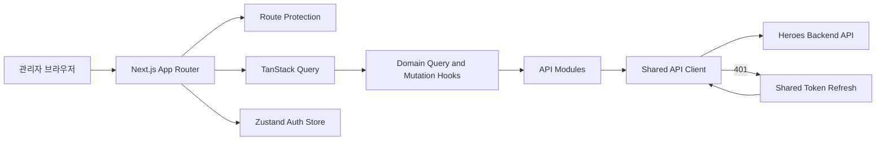

# Heroes Dashboard

게임 정보 서비스 **망스비의 콘텐츠를 조회·관리하고 서비스 데이터를 갱신하는 운영 대시보드**입니다.

캐릭터, 레이드, 인챈트, 아이템 데이터를 도메인별로 관리하며, 통계 시각화와 역할 기반 관리 기능을 제공합니다. 인증 세션 복구, 동시 토큰 갱신 제어, 서버 상태 캐싱, 폼 검증을 공통 구조로 설계해 운영 화면의 안정성과 일관성을 높였습니다.

[](https://nextjs.org/)
[](https://react.dev/)
[](https://www.typescriptlang.org/)
[](https://tanstack.com/query/latest)
[](https://zustand.docs.pmnd.rs/)
[](https://react-hook-form.com/)
[](https://zod.dev/)
[](https://tailwindcss.com/)

## 프로젝트 정보

| 항목          | 내용                                                                        |
| ------------- | --------------------------------------------------------------------------- |
| 프로젝트 유형 | 관리자용 웹 애플리케이션                                                    |
| 주요 사용자   | 관리자                                                                      |
| 개발 기간     | 2026-08-06 ~ 2026-09-17                                                     |
| 참여 인원     | 1명                                                                         |
| 담당 역할     | 모든 기능                                                                   |
| 깃허브        | [Winter100/heroes-dashboard](https://github.com/Winter100/heroes-dashboard) |
| 배포 URL      | [https://admin.heroes-dev.com](https://admin.heroes-dev.com)                |

<hr />

## 주요 기능

#### 로그인


#### 새로고침 후 토큰 및 정보 갱신


#### 캐릭터 생성


#### 아이템 생성 및 폼 검증, 삭제


#### 역할에 따라 권한을 나눔


- 실제 서비스에서 테스트 유저는 생성 버튼을 볼 수 없습니다

<hr />

| 영역             | 기능                                                           |
| ---------------- | -------------------------------------------------------------- |
| 통합 대시보드    | 캐릭터, 레이드, 인챈트, 아이템 통계 시각화                     |
| 캐릭터 관리      | 기본 정보와 이미지, 직업별 스킬 생성·조회·수정·삭제            |
| 레이드 관리      | 기본 정보와 모드별 상세 능력치 관리                            |
| 인챈트 관리      | 인챈트 기본 정보와 단계별 효과 관리                            |
| 아이템 관리      | 아이템 기본 정보와 제작 단계 관리                              |
| 운영 데이터 갱신 | 캐릭터 이미지, 레이드, 인챈트, 제작법, 세트 옵션의 선택적 갱신 |
| 접근 제어        | 로그인 세션 확인과 사용자 역할에 따른 관리 UI 노출             |

## 핵심 구현

### 1. 동시 인증 실패를 하나의 토큰 갱신 요청으로 처리

**문제**

여러 API 요청이 동시에 `401 Unauthorized`를 반환하면 토큰 갱신 요청도 중복으로 발생할 수 있습니다. 또한 액세스 토큰을 메모리에만 저장하면 새로고침 시 인증 상태를 다시 복구해야 합니다.

**구현**

- 액세스 토큰과 사용자 정보는 Zustand 메모리 상태로 관리합니다.
- 보호된 레이아웃 진입 시 refresh token 쿠키를 사용해 세션을 복구합니다.
- 진행 중인 갱신 Promise를 모듈 범위에서 공유해 중복 요청을 방지합니다.
- 갱신을 기다리던 요청은 새 액세스 토큰으로 원래 요청을 다시 실행합니다.
- 갱신에 실패하면 서버 로그아웃을 시도한 뒤 인증 상태를 제거하고 로그인 화면으로 이동합니다.

```text
API 요청
   │
   ├─ 정상 응답 ─────────────────────────▶ 결과 반환
   │
   └─ 401 응답
        │
        ▼
   진행 중인 갱신 요청 확인
        │
        ├─ 있음 ─▶ 기존 Promise 대기
        └─ 없음 ─▶ 세션 갱신 요청 생성
                         │
                         ▼
                 새 토큰으로 요청 재실행
```

구현 근거: [api client](https://github.com/Winter100/heroes-dashboard/blob/dev/utils/api-client.ts), [use sign](https://github.com/Winter100/heroes-dashboard/blob/dev/hooks/use-sign.ts)

### 2. 서버 상태와 인증 상태의 책임 분리

**문제**

API 데이터와 클라이언트 인증 상태를 같은 방식으로 관리하면 캐시 정책과 상태 수명 주기가 뒤섞이고, 변경 이후 어떤 데이터를 다시 불러와야 하는지 파악하기 어려워집니다.

**구현**

- 서버 데이터는 TanStack Query, 액세스 토큰과 사용자 정보는 Zustand로 분리했습니다.
- 도메인별 query key factory를 사용해 목록·상세·통계 캐시의 범위를 명확히 했습니다.
- 생성·수정·삭제 성공 시 영향을 받는 query key만 무효화합니다.
- Query Error Boundary와 Suspense를 조합해 로딩·오류·재시도 흐름을 공통 처리합니다.

구현 근거: [아이템 생성 Dialog](https://github.com/Winter100/heroes-dashboard/blob/main/components/item/dialogs/item-create-dialog.tsx), [use admin item](https://github.com/Winter100/heroes-dashboard/blob/dev/hooks/item/use-admin-item.ts)

### 3. 스키마를 기준으로 관리 폼의 타입과 검증 통합

**문제**

이미지, 중첩 목록, 단계별 효과를 포함하는 관리 폼은 입력 상태와 검증 타입을 별도로 작성할 경우 두 정의가 쉽게 달라질 수 있습니다.

**구현**

- Zod 스키마와 React Hook Form resolver를 연결했습니다.
- 폼 값 타입을 스키마에서 추론해 검증 규칙과 TypeScript 타입을 일치시켰습니다.
- 아이템 제작 단계와 레이드·인챈트 효과처럼 반복되는 입력은 field array로 관리합니다.
- 이미지가 포함된 요청은 `FormData`, 구조화된 데이터는 JSON으로 구분해 전송합니다.

구현 근거: [아이템 생성 폼](https://github.com/Winter100/heroes-dashboard/blob/main/components/item/forms/item-edit-form.tsx), [아이템 Schema](https://github.com/Winter100/heroes-dashboard/blob/main/schema/item.schema.ts)

### 4. 조회와 관리 권한을 분리한 운영 UI

**문제**

일반 사용자에게 조회 기능은 제공하면서 데이터 변경 버튼은 관리자에게만 노출해야 했습니다.

**구현**

- 인증 응답의 사용자 역할을 `ADMIN | USER` 유니온 타입으로 제한했습니다.
- 공통 `RoleGate`에서 허용 역할을 검사해 관리 액션의 렌더링을 제어합니다.
- 생성·수정·삭제 작업은 공통 확인 다이얼로그와 toast 피드백을 사용합니다.
- mutation 진행 중에는 중복 제출을 막고 성공·실패 결과를 사용자에게 전달합니다.

```ts
type RoleGateProps = {
  allowedRoles: readonly UserRole[];
  children: ReactNode;
  fallback?: ReactNode;
};

export const RoleGate = ({
  allowedRoles,
  children,
  fallback = null,
}: RoleGateProps) => {
  const role = useAuthStore((state) => state.user?.role);

  if (!role || !allowedRoles.includes(role)) {
    return fallback;
  }

  return children;
};
```

구현 근거: [아이템 갱신 폼](https://github.com/Winter100/heroes-dashboard/blob/main/components/auth/role-gate.tsx)

### 5. 사용자 서비스의 캐시를 선택적으로 갱신

관리 데이터 변경 후 사용자 서비스에 반영해야 하는 범위를 태그로 구분했습니다. 관리자는 캐릭터 이미지, 레이드, 인챈트, 아이템 제작법과 세트 옵션 중 필요한 데이터만 선택해 갱신할 수 있습니다.

갱신 요청은 지정된 태그와 선택적 리소스 ID를 전달하며, 별도 환경 변수로 관리하는 갱신 키를 요청 헤더에 포함합니다.

구현 근거: [아이템 갱신 폼](https://github.com/Winter100/heroes-dashboard/blob/main/components/item/dialogs/item-revalidate-dialog.tsx), [갱신 API](https://github.com/Winter100/heroes-dashboard/blob/main/api/revalidate-api.ts)

## 구조



```text
app/          페이지, 레이아웃, 라우팅
api/          도메인별 API 요청 함수
components/   공통 UI와 도메인 컴포넌트
hooks/        query와 mutation 로직
queries/      도메인별 query key
schema/       Zod 폼 검증 스키마
store/        클라이언트 인증 상태
types/        API 응답과 도메인 타입
utils/        공통 API 클라이언트
```

## 기술 스택

| 분류          | 기술                               | 적용 내용                                   |
| ------------- | ---------------------------------- | ------------------------------------------- |
| Framework     | Next.js 16, React 19               | App Router 기반 페이지·레이아웃 구성        |
| Language      | TypeScript                         | API 응답, 폼, 역할 정보의 타입 정의         |
| Server State  | TanStack Query                     | 데이터 캐싱, mutation, 선택적 캐시 무효화   |
| Client State  | Zustand                            | 액세스 토큰과 사용자 정보 관리              |
| Form          | React Hook Form, Zod               | 폼 상태와 스키마 기반 검증                  |
| UI            | Tailwind CSS, shadcn/ui, Base UI   | 반응형 컴포넌트와 다크 테마 구성            |
| Visualization | Recharts                           | 도메인별 운영 통계 시각화                   |
| Quality       | ESLint, TypeScript, GitHub Actions | lint, typecheck, production build 자동 검증 |

## 실행 방법

### 요구 사항

- Node.js 22 이상
- npm
- 실행 가능한 Heroes Backend API

### 환경 변수

프로젝트 루트에 `.env.local`을 생성합니다.

```env
NEXT_PUBLIC_BACKEND_URL=
NEXT_PUBLIC_REVALIDATE=
```

| 변수                      | 설명                           |
| ------------------------- | ------------------------------ |
| `NEXT_PUBLIC_BACKEND_URL` | Heroes Backend API 주소        |
| `NEXT_PUBLIC_REVALIDATE`  | 서비스 데이터 갱신 요청 식별값 |

### 설치 및 실행

```bash
npm install
npm run dev
```

기본 개발 서버는 [http://localhost:3000](http://localhost:3000)에서 실행됩니다.

### 검증

```bash
npm run lint
npm run typecheck
npm run build
```

Pull Request와 `main` 브랜치 push 시 GitHub Actions가 의존성 설치, lint, typecheck, production build를 순서대로 실행합니다.

## 향후 개선 계획

- 테스트 코드 작성
- 다수의 데이터 입력 및 수정 기능
